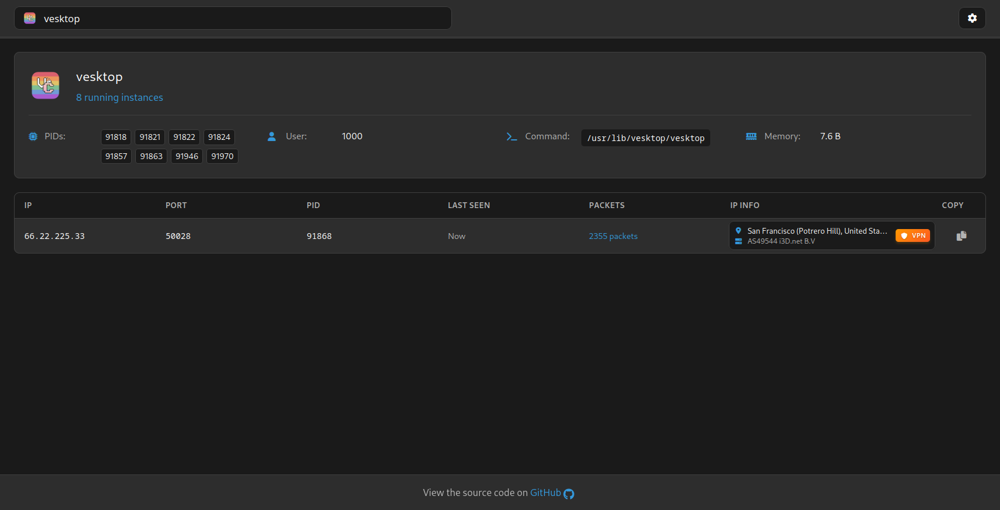

# Linux Network Monitor

A real-time network connection monitoring tool for Linux with a modern web interface. Monitor network connections of specific processes with detailed IP information and VPN detection.



## Features

- 🔍 Real-time connection monitoring
- 🚀 Process-specific network tracking
- 🌍 IP geolocation and VPN detection (via ProxyCheck.io)
- 📊 Connection statistics and packet counting
- 🎨 Modern, responsive web interface
- ⚡ Fast and lightweight
- 🔄 Auto-reconnection and persistent settings
- 📋 Customizable copy formats

## Requirements

- Linux operating system
- Node.js 16 or higher
- Root privileges (for strace functionality)
- Around 100MB of available RAM
- `strace` installed

## Installation

1. Clone the repository:
```bash
git clone https://github.com/zebratic/linux-network-monitor.git
cd linux-network-monitor
```

2. Install dependencies:
```bash
npm install
```

3. Create a configuration file (optional):
```bash
cp config.example.json config.json
```

## Usage

1. Start the server (requires root privileges):
```bash
sudo node index.js
```

2. Open your web browser and navigate to:
```
http://localhost:9000
```

## Configuration

The application can be configured through the web interface or by editing `config.json`:

```json
{
    "port": 9000,
    "updateInterval": 1000,
    "connectionTimeout": 5,
    "copyFormat": "{IP}:{PORT}",
    "proxyCheckApiKey": "",
    "enableProxyCheck": false,
    "showLocalConnections": true
}
```

### Configuration Options

- `port`: Web server port (default: 9000)
- `updateInterval`: Connection update frequency in milliseconds (100-10000)
- `connectionTimeout`: Time before inactive connections are removed in seconds (1-3600)
- `copyFormat`: Format for copying connection details. Available variables:
  - `{IP}`: Remote IP address
  - `{PORT}`: Remote port
  - `{PID}`: Process ID
  - `{PROGRAM}`: Program name
- `proxyCheckApiKey`: API key for ProxyCheck.io service (optional)
- `enableProxyCheck`: Enable/disable IP information lookup
- `showLocalConnections`: Show/hide local network connections

## Features in Detail

### Process Selection
- Search for processes by name
- View process details including PIDs, user, and memory usage
- Monitor multiple instances of the same process

### Connection Monitoring
- Real-time connection tracking
- Connection timeout filtering
- Packet counting
- Local address filtering
- Copy connection details with custom formats

### IP Information (with ProxyCheck.io)
- VPN/Proxy detection
- Geographic location
- ASN information
- Provider details
- Connection type identification

### User Interface
- Responsive design
- Keyboard navigation
- Persistent settings
- Auto-reconnection

## Development

The project structure:
```
├── index.js              # Main server file
├── strace-parser.js      # strace output parser
├── proxycheck-service.js # IP information service
├── config.json          # Configuration file
├── public/              # Static files
│   ├── css/            # Stylesheets
│   └── js/             # Client-side JavaScript
└── views/              # EJS templates
    ├── layouts/        # Page layouts
    └── partials/       # Reusable components
```

## Contributing

1. Fork the repository
2. Create your feature branch (`git checkout -b feature/amazing-feature`)
3. Commit your changes (`git commit -m 'Add amazing feature'`)
4. Push to the branch (`git push origin feature/amazing-feature`)
5. Open a Pull Request

## License

This project is licensed under the MIT License - see the [LICENSE](LICENSE) file for details.

## Acknowledgments

- [ProxyCheck.io](https://proxycheck.io/) for IP information services
- [Font Awesome](https://fontawesome.com/) for icons
- [Express](https://expressjs.com/) for the web framework
